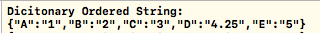
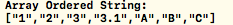
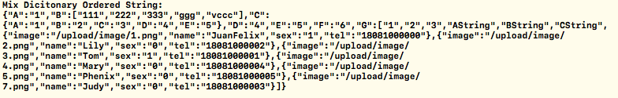
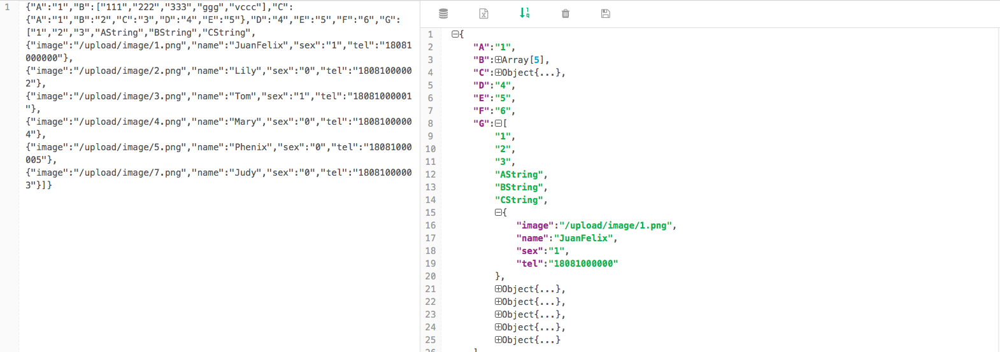

### `OrderedDictionary String`

>
获取一个排序后的Dicionary/Array Json字符串（按Key/Value升序排列）

-

####  `Pre`

>
开始选择的是网上的[OrderedDictionary](https://github.com/lukaskubanek/OrderedDictionary)，发现排序之后不能被序列化

```
JSONSerialization.isValidJSONObject(sortDic) == false
```

- `HOrderedJsonString`

>
纯为了排序的情况估计很少，最终大多是为了`获取一个String`。所以自己简单实现了一下
>
不一定满足所有情况，但处理简单的文本结构是可以的

####  `使用方法`

>
xxx`.zx_sortJsonString()`

`e.g.`

- `Dictionary(字典)`

```
let dicA:Dictionary<String,Any> = ["A":Int(1),"E":"5","D":Double(4.25),"B":"2","C":"3"]

dicA.zx_sortJsonString()
```
`结果输出`
>


- `Array(数组)`

```
let array:Array<Any> = ["B",Double(3.1),"3","C",Int(2),"A",Int(1)]
array.zx_sortJsonString()
```
`结果输出`
>


- `字典数组嵌套`

```
let userInfo:Dictionary<String,Any> = ["B":["222","vccc","333","111","ggg"],
                                                "D":"4",
                                                "C":["A":"1","E":"5","D":"4","B":"2","C":"3"],
                                                "A":"1",
                                                "E":"5",
                                                "G":["BString",
                                                     "3",
                                                     "CString",
                                                     Int(2),
                                                     "AString",
                                                     Int(1),
                                                     ["name":"JuanFelix",
                                                      "tel":"18081000000",
                                                      "sex":Int(1),
                                                      "image":"/upload/image/1.png"],
                                                     ["name":"Tom",
                                                      "sex":Int(1),
                                                      "image":"/upload/image/3.png",                                              "tel":"18081000001"],
                                                     ["tel":"18081000002",
                                                      "image":"/upload/image/2.png",
                                                      "name":"Lily",
                                                      "sex":Int(0)],
                                                     ["tel":"18081000003",
                                                      "sex":Int(0),
                                                      "image":"/upload/image/7.png",
                                                      "name":"Judy"],
                                                     ["image":"/upload/image/4.png",
                                                      "sex":Int(0),
                                                      "name":"Mary",
                                                      "tel":"18081000004"],
                                                     ["sex":Int(0),
                                                      "tel":"18081000005",
                                                      "name":"Phenix",
                                                      "image":"/upload/image/5.png"]
                                                     ],
                                                "F":"6"]
print(userInfo.zx_sortJsonString())
```
`结果输出`
>


 `格式化结果`
>


---

#### `实现说明` 

>
就一个简单的递归遍历

- `只处理一层`

`Test1:` 先获取所有Key值并排序，再取值拼接

```
 func zx_TestAlv1() -> String {
    var tempDic = self as! Dictionary<String,Any>
    var keys = Array<String>()
    for key in tempDic.keys {
        keys.append(key)
    }
    keys.sort { $0 < $1 }
    var arr: Array<String> = []
    for key in keys{
        arr.append("\"\(key)\":\"\(tempDic[key]!)\"")
    }
    
    var signString = "{"
    signString += arr.joined(separator: ",")
    signString += "}"
    return signString
}
```

`Test2:` 先调用系统的排序方法获取String,再通过正则处理,再取值拼接

>
let dicA:Dictionary<String,Any> = ["A":Int(1),"E":"5","D":Double(4.25),"B":"2","C":"3"]
>
let sortedA = dicA.sorted { $0.0 < $1.0}//得到一个奇葩的数组

`type(of: sortedA)`
>
Swift.Array<(key : Swift.String, value : Any)>

`sortedA.description`
>
"[(key: \"A\", value: 1), (key: \"B\", value: \"2\"), (key: \"C\", value: \"3\"), (key: \"D\", value: 4.25), (key: \"E\", value: \"5\")]"

```
func zx_TestBlv1() -> String {
    let tempDic = self as! Dictionary<String,Any>
    //系统排序后得到奇葩的 (key: Key, value: Value) 数组，没法玩啊
    //所以直接获取Description String
    var string = tempDic.sorted { $0.0 < $1.0 }.description
    //正则 根据上面的String格式，获取 key，value的分组
    let regexString = "\\(key:[ \t]?\"?([^()\"]*)\"?[ \t]?,[ \t]?value:[ \t]*\"?([^()\"]*)\"?\\)"
    
    let regex = try? NSRegularExpression.init(pattern: regexString, options: .caseInsensitive)
    let matches = regex?.matches(in: string, options: [], range: NSMakeRange(0, string.characters.count))
    if let matches = matches {
        var arr: Array<String> = []
        for  match in matches {
            let g1 = match.rangeAt(1)
            let g2 = match.rangeAt(2)
            var startIndex  = string.index(string.startIndex, offsetBy: g1.location)
            var endIndex    = string.index(string.startIndex, offsetBy: (g1.location + g1.length))
            let key = "\"\(string.substring(with: startIndex..<endIndex))\""
            
            startIndex  = string.index(string.startIndex, offsetBy: g2.location)
            endIndex    = string.index(string.startIndex, offsetBy: (g2.location + g2.length))
            let value = "\"\(string.substring(with: startIndex..<endIndex))\""
            arr.append("\(key):\(value)")
        }
        var signString = "{"
        signString += arr.joined(separator: ",")
        signString += "}"
        return signString
    }
    return ""
}

```

- `处理多层嵌套`

>
字典套数组，数组套字典
>
一层解决了，加个递归就OK了

```
extension Dictionary {
    func zx_sortJsonString() -> String {
        var tempDic = self as! Dictionary<String,Any>
        var keys = Array<String>()
        for key in tempDic.keys {
            keys.append(key)
        }
        keys.sort { $0 < $1 }
        var signString = "{"
        var arr: Array<String> = []
        for key in keys {
            let value = tempDic[key]
            if let value = value as? Dictionary<String,Any> {//Dictionary 递归
                arr.append("\"\(key)\":\(value.zx_sortJsonString())")
            }else if let value = value as? Array<Any> {//Array 递归
                arr.append("\"\(key)\":\(value.zx_sortJsonString())")
            }else{//其他 直接拼接
                arr.append("\"\(key)\":\"\(tempDic[key]!)\"")
            }
        }
        signString += arr.joined(separator: ",")
        signString += "}"
        return signString
    }
}

extension Array {
    func  zx_sortJsonString() -> String {
        let array = self
        var arr: Array<String> = []
        var signString = "["
        for value in array {
            if let value = value as? Dictionary<String,Any> {//Dictionary 递归
                arr.append(value.zx_sortJsonString())
            }else if let value = value as? Array<Any> {//Array 递归
                arr.append(value.zx_sortJsonString())
            }else{//其他 直接拼接
                arr.append("\"\(value)\"")
            }
        }
        arr.sort { $0 < $1 }
        signString += arr.joined(separator: ",")
        signString += "]"
        return signString
    }
}
```